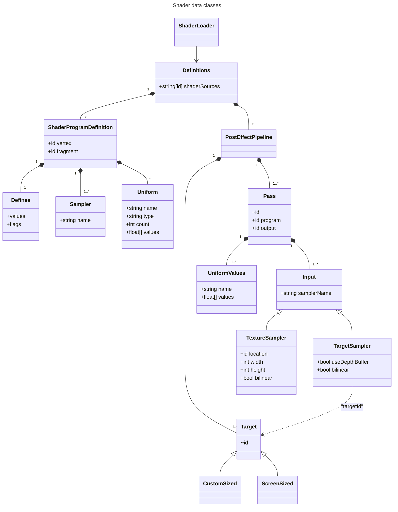
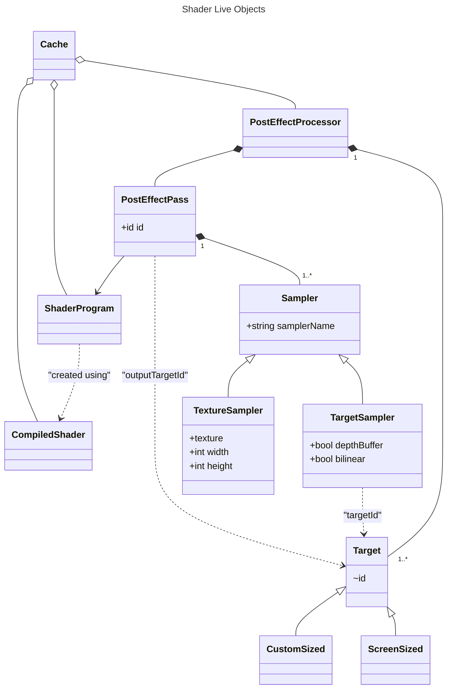
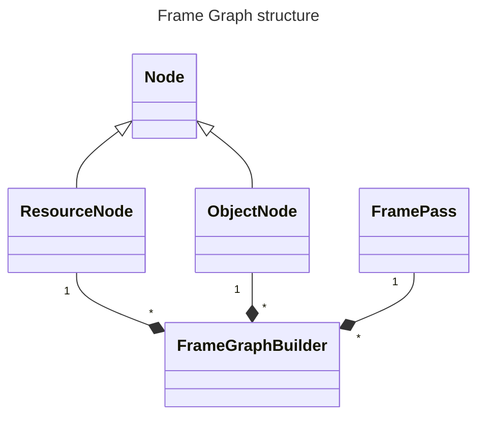

# Minecraft's new Shader system

## Shader Loading

`ShaderLoader` loads every file in the `shaders` directory
ending in `.json`, `.fsh`, `.vsh`, or `.glsl`

- `.glsl` extensions are exclusively used for common shader includes
- `.fsh` and `.vsh` files are loaded as strings and compiled later
- `.json` files are loaded as `ShaderProgramDefinition`

Core shaders are referenced in `ShaderProgramKeys.ALL`. These shaders are all
preloaded in the `ShaderLoader`'s `apply` stage, at which point any failure causes a crash.

Post-process effects (also called "post chains") are loaded lazily.

## Post-process effect rendering

Post effect rendering is now divided into two steps:
1. building a reusable frame graph
2. rendering the frame graph

### Building the frame graph

